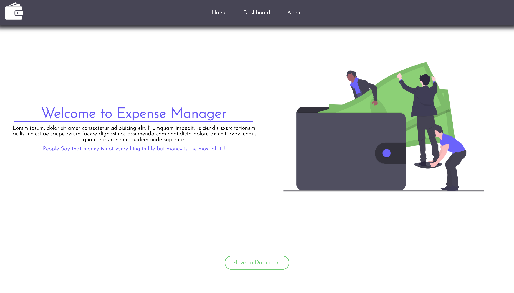

# Expense Manager

Expense manager is a javaScript application which is helpful for managing your Expanses.

## Features

- You can delete the expenses and add another one.
- The data is stored on the local storage.
- The website will access data anytime you open it.

## Images

## Weblink

###### I don't own any of the images and logo used here!
